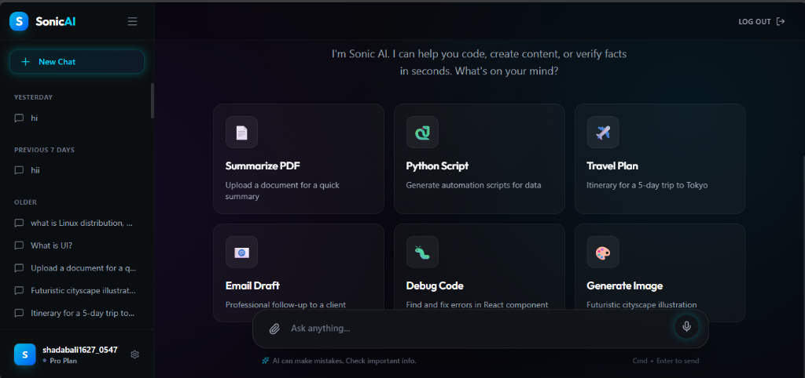
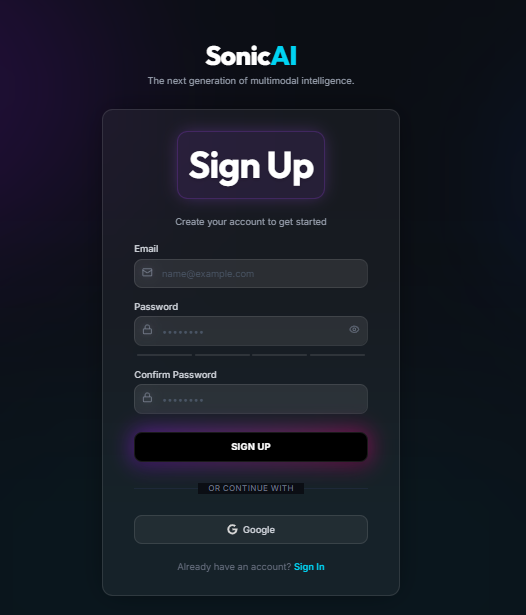
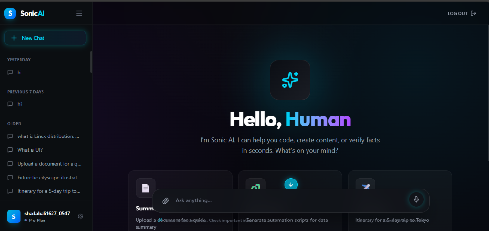

# Sonic AI

<div align="center">
  <h3>The Next Generation of Multimodal Intelligence</h3>
  <p>
    <a href="https://nextjs.org/">
      
    </a>
    <a href="https://tailwindcss.com/">
      
    </a>
    <a href="https://fastapi.tiangolo.com/">
      
    </a>
    <a href="https://python.org/">
      
    </a>
    <a href="https://mongodb.com/">
      
    </a>
  </p>
  <br />
  <a href="https://sonic-ai.theworkpc.com" target="_blank">
    
  </a>
</div>

<br />

Sonic AI is a modern, high-performance AI chat application built designed for speed, scalability, and a premium user experience. It leverages the power of **Google Gemma 3** models to provide multimodal interaction (text and vision) in a sleek interface.

## 📸 Screenshots

<div align="center">
  
  <br/><br/>
  <div style="display: flex; gap: 10px; justify-content: center;">
    
    
  </div>
</div>

## 🚀 Features

-   **🤖 Advanced AI Integration**: Powered by **Google Gemma 3** (Text) and **Gemma 3 Vision** (Image Analysis).
-   **✨ Modern UI/UX**: Built with **Next.js 16**, **Tailwind CSS 4**, and **Framer Motion** for fluid animations.
-   **🔐 Secure & Robust**: Full authentication system (Email/Password, Google OAuth) with secure session management.
-   **💬 Rich Chat Experience**:
    -   Real-time streaming responses with "typewriter" effect.
    -   Markdown rendering for code and rich text.
    -   Chat history with persistence.
    -   Voice capabilities (Speech-to-Text & Text-to-Speech).
-   **📱 Fully Responsive**: Optimized for generic desktop, tablet, and mobile experiences.

## 🛠️ Tech Stack

### Frontend
-   **Framework**: [Next.js 16](https://nextjs.org/) (React 19)
-   **Styling**: [Tailwind CSS 4](https://tailwindcss.com/)
-   **Animations**: [Framer Motion](https://www.framer.com/motion/)
-   **State Management**: React Hook Form, Zod

### Backend
-   **Framework**: [FastAPI](https://fastapi.tiangolo.com/)
-   **Language**: Python 3.10+
-   **Database**: [MongoDB](https://www.mongodb.com/) with [Beanie ODM](https://beanie-odm.dev/)
-   **AI Engine**: LangChain & Google Gemini API

## 📂 Project Structure

```bash
sonic-ai/
├── backend/                # Python FastAPI Backend
│   ├── app/
│   │   ├── core/           # Config, Security
│   │   ├── models/         # Database Models
│   │   ├── routes/         # API Endpoints
│   │   └── main.py         # App Entry Point
├── frontend/               # Next.js Frontend
│   ├── src/
│   │   ├── app/            # App Router Pages
│   │   ├── components/     # UI Components
│   │   ├── hooks/          # Custom Hooks
└── docs/                   # Documentation & Assets
```

## 🏁 Getting Started

### Prerequisites
-   **Node.js** (v18+)
-   **Python** (v3.10+)
-   **MongoDB** URI

### Quick Setup

1.  **Clone the repo**
    ```bash
    git clone https://github.com/shadabali1627/Sonic-AI.git
    cd Sonic-AI
    ```

2.  **Setup Backend**
    ```bash
    cd backend
    python -m venv .venv
    source .venv/bin/activate  # Windows: .venv\Scripts\activate
    pip install -r requirements.txt
    python -m uvicorn app.main:app --reload
    ```

3.  **Setup Frontend**
    ```bash
    cd frontend
    npm install
    npm run dev
    ```

## 🧪 Testing
See [TESTING.md](./TESTING.md) for details on running tests.

## 🤝 Contributing
Contributions are welcome! Please feel free to submit a Pull Request.

## 📄 License
[MIT](https://choosealicense.com/licenses/mit/)
