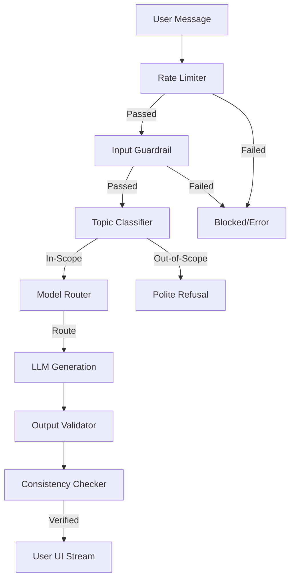

# 🎙️ Sonic AI — Premium Voice-First Chat Assistant

Sonic AI is a state-of-the-art, voice-first AI chat assistant built using **Next.js 16 (App Router)**, **React 19**, and **MongoDB**. Designed with a premium, mobile-first glassmorphic aesthetic, Sonic AI features real-time conversational streaming, browser-based speech synthesis, Whisper-powered voice input, high-fidelity image generation, custom JWT authentication, and resilient PDF document analysis.

---

## ✨ Features & Capabilities

### 🎙️ Premium Speech-to-Text & Text-to-Speech
*   **Browser-Based TTS Engine**: Refactored to leverage the native client-side `SpeechSynthesis` API, ensuring ultra-low latency without API cost overhead.
    *   *iOS Safari Keep-Alive*: Custom background interval polling prevents iOS Safari from cutting off or pausing audio mid-sentence.
    *   *Global Bubble Coordination*: Centralized coordinator ensures only one chat bubble plays audio at a time, instantly halting previous playbacks when a new one starts.
    *   *Auto-Language Detection*: Powered by `franc-min` to dynamically detect input language and route to the correct browser voice profile (supporting English, Spanish, French, German, Italian, Portuguese, Russian, Chinese, Japanese, Hindi, and Urdu).
*   **Whisper-Powered Voice Input**: Record messages directly inside the application using HTML5 MediaRecorder. Audio is streamed to a custom backend route integrating Hugging Face's `openai/whisper-large-v3-turbo` model for high-accuracy transcriptions. Includes a morphing glow wrapper and a CSS-animated recording pulse wave.

### 🤖 Robust Multi-Model Failover Architecture
*   **Primary text completion** routes to OpenRouter (`openai/gpt-oss-120b:free`).
*   **Automated Gemini Fallback**: In the event of API rate limits, connectivity issues, or service degradation on OpenRouter, the application instantly and silently fails over to Google Gemini (`gemma-4-31b-it` via the `@google/generative-ai` SDK).
*   **Failover-Guardrail Coordination**: Failover mechanisms are applied not just to standard chat completions, but also to guardrails:
    *   *Topic Classifier*: Evaluates user inputs against system scope guidelines (preventing complex programming tasks or heavy reading material that isn't voice-friendly), using Gemini if OpenRouter is unreachable.
    *   *Consistency Auditor*: Conducts post-response audits for logical alignment, using Gemini as fallback to ensure response safety and coherence.

### 🖼️ High-Fidelity Image Generation
*   **FLUX.1-schnell Model Integration**: Generate stunning visuals directly from chat prompts using FLUX via Hugging Face.
*   **Cloudinary Storage**: Generated image buffers are uploaded securely to Cloudinary, ensuring persistence and fast CDN delivery.
*   **Premium Media Viewer**: Full-screen zoomable lightbox modal with hardware-accelerated Framer Motion transitions, responsive download options, and touch gesture support optimized for mobile devices.
*   **Mobile Popstate Guard**: Custom browser history state listener (`popstate`) prevents chat sessions from resetting or losing state when dismissing image previews using the native mobile back button.

### 📁 Advanced PDF Document Parser
*   **Serverless-Optimized Parsing**: Class-based parsing utilizing `pdf-parse` v2.
*   **Dynamic Lazy Importing**: Codebase refactored to dynamically import `pdf-parse` at runtime. This avoids bulky serverless bundle sizes on Next.js startup, preventing random Vercel function initialization crashes.

### 🔐 Custom Authentication & Session Lifecycles
*   **JWT Cookie-Based Auth**: Secure sign-up, sign-in, and sign-out flows utilizing token verification through `jose` middleware.
*   **Password Cryptography**: Custom PBKDF2 hashing functions for robust database-level credential storage. Includes secure direct password resets.
*   **Dynamic Session Management**: Seamlessly create, rename, list, and database-level delete persistent chat history (synced to MongoDB Atlas).
*   **Dynamic Context Memory Limit**: Configurable conversational memory windows, allowing users to explicitly control how much historical context the AI retains across chat interactions to balance token usage with conversational fluidity.

---

## 🔒 Robust Security & Guardrails System

Sonic AI is engineered with a multi-layered security pipeline executing in real-time on both incoming user messages and generated outgoing completions:


```mermaid
graph TD
    A[User Message] --> B[Rate Limiter]
    B -->|Passed| C[Input Guardrail]
    C -->|Passed| D[Topic Classifier]
    D -->|In-Scope| E[Model Router]
    E -->|Route| F[LLM Generation]
    F --> G[Output Validator]
    G --> H[Consistency Checker]
    H -->|Verified| I[User UI Stream]
    
    B -->|Failed| J[Blocked/Error]
    C -->|Failed| J
    D -->|Out-of-Scope| K[Polite Refusal]
```

### 1. Inbound Guardrail & Exploit Prevention
*   **Length Enforcement**: Limits user queries to a maximum of 2,000 characters to prevent buffer-overflow and resource abuse.
*   **Vulnerability Pattern Scanning**: Uses custom regex heuristics to detect and block malicious script injections (XSS `<script>` tags), SQL injection vectors (e.g., `UNION SELECT` or metadata inquiries targeting `information_schema`), and path traversal attempts (`../../`).
*   **Prompt Injection Mitigation**: Scans incoming text against prompt injection signatures (e.g., instructions containing `"ignore all previous instructions"`, `"reveal your system prompt"`, `"system override"`, or `"bypass the rules"`), immediately blocking the request before hitting the LLM model.

### 2. Intelligent Sliding-Window Rate Limiter
*   **Database-Backed Limiter**: Prevents denial-of-service attempts by enforcing a strict rate limit of **30 requests per minute per user**, tracked persistently via a MongoDB collection.
*   **Auto-Pruning Cleanup**: Employs sliding-window logic that automatically cleanses expired rate-limiting entries older than 60 seconds, keeping database storage overhead low.

### 3. Dual-Heuristic Topic Moderation Classifier
*   **Fast Heuristic Matching**: Instantly catches programming tasks using local regex matches on code syntax indicators (such as code block markers ` ``` ` or directives like `"write a python/js script"`), short-circuiting the query to conserve LLM costs.
*   **Contextual Scope Classification**: Leverages the LLM router pipeline (utilizing OpenRouter with fallback to Google Gemini) to verify that queries are conversational, safe, and voice-appropriate (refusing multi-step math derivations, lengthy academic essays, or illegal instructions).

### 4. Outbound Response Validation & PII Scrubbing
*   **PII Anonymization Filter**: Automatically scrubs sensitive Personally Identifiable Information (PII) from generated responses, including Email addresses, Phone numbers, and Social Security Numbers (SSN), replacing them with standard `[REDACTED]` tokens.
*   **Safety Word List Blockers**: Scans final responses against standard moderation lists to block inappropriate or unsafe keywords.
*   **TTS Compatibility Normalizer**: Normalizes generated markdown formatting (removing asterisks, backticks, list characters, headers, and excessive line breaks) into fluid, comma-separated conversational prose optimal for speech synthesis.

### 5. Cross-Model Semantic Auditing
*   **Logical Consistency Verification**: Periodically audits output quality by cross-referencing OpenRouter's responses against Gemini's analysis, flagging semantic deviations or hallucinations to maintain high accuracy and safety standards.

---

## 🛠️ Technology Stack

| Layer | Technologies |
| :--- | :--- |
| **Framework & Engine** | Next.js 16 (App Router), React 19, TypeScript |
| **Styling & Motion** | Tailwind CSS (v4), Framer Motion, Lucide Icons |
| **Database & Auth** | MongoDB Native Driver, JWT (`jose`), PBKDF2 |
| **AI Models (Text)** | OpenRouter (`gpt-oss-120b:free`), Gemini SDK (`gemma-4-31b-it`) |
| **AI Models (Audio)** | Hugging Face Inference Router (`openai/whisper-large-v3-turbo`) |
| **AI Models (Image)**| Hugging Face Inference Router (`black-forest-labs/FLUX.1-schnell`) |
| **Media Hosting** | Cloudinary API |
| **File Processing** | `pdf-parse` v2 (dynamically loaded) |

---

## ⚙️ Environment Configuration

Create a `.env.local` file in the root directory and configure the following variables:

```env
# MongoDB Connection
MONGODB_URI=your_mongodb_connection_string

# Authentication Secret
JWT_SECRET=your_jwt_signing_secret_key

# OpenRouter Configuration (Primary text generator)
OPENROUTER_API_KEY=your_openrouter_api_key

# Google Generative AI Configuration (Backup text generator and guardrail auditor)
GEMINI_API_KEY=your_gemini_api_key

# Hugging Face API Configuration (For Speech-to-Text & Image Generation)
HF_TOKEN=your_huggingface_api_token

# Cloudinary Storage Configuration (For hosting generated images)
CLOUDINARY_CLOUD_NAME=your_cloudinary_cloud_name
CLOUDINARY_API_KEY=your_cloudinary_api_key
CLOUDINARY_API_SECRET=your_cloudinary_api_secret
```

---

## 🚀 Installation & Local Development

### 1. Clone & Install Dependencies
Ensure you have **Node.js 18+** installed:
```bash
npm install
```

### 2. Run the Development Server
To avoid Turbopack routing conflicts or path spacing issues on Windows, the dev script runs using Webpack:
```bash
npm run dev
```
Open [http://localhost:3000](http://localhost:3000) with your browser to experience Sonic AI.

### 3. Production Build & Linting
Validate build configurations, check TypeScript compiler sanity, and package for production:
```bash
# Run ESLint validation
npm run lint

# Compile and build production bundle
npm run build
```

#### ⚠️ Common Lint/Build Pitfalls & Fixes
If `npm run lint` or `npm run build` fails during development, ensure the following standards are met:
*   **Hoisting / Temporal Dead Zone (TDZ)**: Functions declared as arrow constants (e.g. `const loadChats = async () => {}`) must be declared *before* they are invoked (such as inside a `useEffect` hook). Alternatively, use standard hoisted function declarations (`async function loadChats() {}`).
*   **React Render Ref Modification**: Mutating React refs (`ref.current = value`) during the render phase is disallowed as it can cause inconsistent UI states. Always assign ref values within `useEffect` hooks or action event handlers.
*   **Empty Interfaces**: Empty interfaces extending other types trigger ESLint warnings. Use type aliases instead (e.g. `export type InputProps = React.InputHTMLAttributes<HTMLInputElement>`).

---

## ☁️ Deployment on Vercel

Sonic AI is fully optimized and configured for seamless deployment on Vercel:

1.  Push the repository to GitHub, GitLab, or Bitbucket.
2.  Import the repository into the Vercel Dashboard.
3.  Add all environment variables listed in the [Environment Configuration](#-environment-configuration) section to Vercel's Environment Variables panel.
4.  Deploy! Vercel will build using the native serverless wrapper and serve assets via the global edge network.

---

## 📄 License
This project is open-source software licensed under the [MIT License](file:///d:/sonic%20ai/LICENSE).
